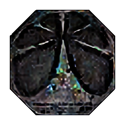

<h1 style="text-align: center;"> Company of Champions Guidelines </h1>

> Roles are obtainable for all listed games. Click the list below to go to the different game guidelines.

 * [Demon's Souls](./des.html).
 * [Dark Souls or Dark Souls: Remastered](./ds1.html).
 * [Dark Souls II or Dark Souls II: Scholar of the First Sin](./ds2.html).
 * [Dark Souls III](./ds3.html).
 * [Bloodborne](./bb.html).
 * [Nioh](./nioh.html).
 * [Hollow Knight](./hollowknight.html).
 
_Dark Souls: Remastered_ and _Dark Souls II: Scholar of the First Sin_ have the same requirements as _Dark Souls_ and _Dark Souls II_. All versions of either game are permitted.

### Banned Criteria

- Summoning players / NPCs is not acceptable. The run will be disqualified if this is done. 
  - This rule doesn't mean you can't do Sirris' or Anri's quest as you are summoned into their world for their quests (these are not bossfights, so they don't count). 
  - Also the case for Biorr of the Twin Fangs vs the Penetrator.

- Unless required by the criteria for a run, it is not allowed to obtain items before it is usually possible. For example, spawning in a boss weapon as soon as you start a normal SL1/BL4 run is unacceptable and will result in a disqualification.
   - Exceptions: 
     - Ask the server mods for discussion and/or permission if there is the possibility of such.
     - Normally it is acceptable to use Cheat Engine to give yourself items required for a Legend run. 
	 > Spawning a Soldering Iron before Iudex Gundyr for a Soldering Iron only run is perfectly acceptable.

- Cheating and cheesing during gameplay is strictly forbidden. Enabling iframes, tumblebuffing, kills outside the bosses' arenas, alteration of your stats, breaking the AI so it becomes unable to harm you... Any of this, or anything similar, will result in a disqualification. Please ask a mod if you are uncertain about what is allowed and what isn't.

### Proof for Champion of Dark Souls I, II or III | Demon's Souls | Bloodborne | Nioh |

**You need to beat all boss fights - including DLCs - then show proof.**

You have **two** choices in order to show proof:

* Record a video, showing your character stats and all boss souls/bonfires/empty arenas.

* Make a gallery of **full** screenshots (no cropping or editing will be allowed) of your character stats, all boss souls, and bonfires/empty arenas. See the page for the game you are playing for specific requirements as this varies by game.

_If you used any boss souls for items, show them as well for proof. It is strongly recommended not to use boss souls for souls; you are destroying your own SL1 proof._

### Proof for Legend of Dark Souls I, II or III | Demon's Souls | Bloodborne | Nioh 
> Legend runs are Champion runs with one or more significant handicaps. Check the games' pages for a list of what counts, and what doesn't. If you have any doubt, ask the server mods.

To prove and verify this challenge, you need to beat and record/stream all boss fights - _including DLCs*_. It is also recommended to start recordings before you enter the boss fog. A recording where the fight is ongoing and the boss has lost significant health or has advanced through phases will not be accepted, disqualifying the fight.

If you are streaming or recording an entire run (start to finish), please provide timestamps as mods are expecting to check boss kills. Not taking the time to do so will just cause the verification to have a longer wait.

|* _Unless you are going for a run with the typical 'Any%' rule set. This is only applicable to speedrunning._
